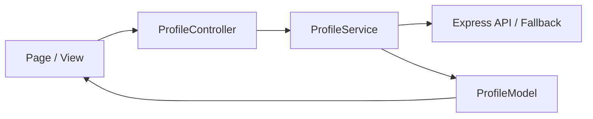
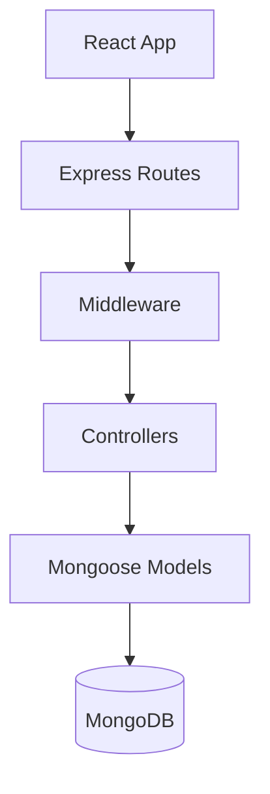

# Project — website-ts

Dokumen referensi utama proyek **website-ts**: portfolio fullstack Ricky Chen dengan admin panel, CMS ringan, dan API Express + MongoDB.

---

## Ringkasan

| Aspek             | Detail                                                         |
| ----------------- | -------------------------------------------------------------- |
| **Nama**          | `website-ts`                                                   |
| **Tipe**          | Portfolio profesional + Admin CMS (konten saja)                |
| **Publik**        | Home, Projects, Experience, About, Resume, Contact             |
| **Tidak dipakai** | Learning, global search, efek dekoratif, admin job-hunt        |
| **Frontend**      | React 19, TypeScript, React Router 7, CSS Modules              |
| **Backend**       | Express 5, TypeScript, Mongoose, MongoDB                       |
| **Arsitektur**    | Clean Architecture + MVC + Component-based UI                  |
| **Tema desain**   | **Signal** — slate + sky cyan (`src/styles/design-tokens.css`) |

---

## Tujuan produk

1. Menampilkan profil profesional (pengalaman, proyek, skill, pendidikan, testimoni).
2. Menyediakan halaman publik yang cepat, responsif, dan accessible.
3. Admin panel untuk mengelola konten (skills, projects, resume, notes, dll.).
4. API terpusat dengan validasi, rate limiting, dan keamanan dasar (helmet, csrf, sanitize).

---

## Prinsip arsitektur

### SOLID (penerapan di codebase)

| Prinsip                       | Penerapan                                                                               |
| ----------------------------- | --------------------------------------------------------------------------------------- |
| **S** — Single Responsibility | `ProfileService` = fetch/cache; `ProfileController` = orchestration; `Button` = UI saja |
| **O** — Open/Closed           | Komponen UI punya `variant` / `size` tanpa mengubah inti komponen                       |
| **L** — Liskov Substitution   | Props React memperluas HTML attributes (`ButtonProps extends ButtonHTMLAttributes`)     |
| **I** — Interface Segregation | `types/domain.ts` — tipe per entitas, bukan satu god-object                             |
| **D** — Dependency Inversion  | Controller menerima `ProfileService` via constructor; halaman memakai context/hooks     |

### Prinsip pendukung

- **KISS** — Satu sumber token CSS; tidak duplikasi logika fetch di banyak komponen.
- **DRY** — `Section`, `Card`, `Button`, utility (`dateUtils`, `stringUtils`) dipakai ulang.
- **OOP (domain)** — `ProfileModel` class dengan factory `create()` dan method domain (`getFeaturedProjects`, `getSkillsByCategory`).
- **Component-based** — Atomic UI → layout → domain → pages.
- **Method-based** — Business logic di class method / service method, bukan inline di JSX.

---

## Struktur direktori

```
website-ts/
├── src/                          # Frontend
│   ├── components/               # Shared (SkipLinks, ThemeToggle, charts, …)
│   ├── config/                   # theme.ts, site-defaults.ts
│   ├── contexts/                 # ThemeContext, ProfileContext, AdminAuthContext
│   ├── controllers/              # MVC — ProfileController (frontend)
│   ├── models/                   # Domain — ProfileModel
│   ├── services/                 # ProfileService, ContactService, AdminService
│   ├── types/                    # domain.ts, API types
│   ├── utils/                    # Pure functions
│   ├── styles/                   # design-tokens.css, base, layout, a11y
│   ├── hooks/                    # useActiveSection, dll.
│   └── views/
│       ├── components/
│       │   ├── ui/               # Atomic: Button, Card, Typography, Loading
│       │   ├── layout/           # Header, Footer, Section
│       │   └── domain/           # ExperienceItem, ProjectCard, SkillBadge, …
│       └── pages/                # Home, Projects, Admin/*, …
├── backend/src/
│   ├── config/                   # Database, env
│   ├── controllers/              # HTTP handlers
│   ├── models/                   # Mongoose schemas
│   ├── routes/                   # Express routers
│   ├── middleware/               # sanitize, auth, rate limit
│   ├── utils/                    # transformProfile, ai, …
│   └── main.ts                   # Entry point
├── public/                       # Static assets, sitemap
├── docs/                         # Dokumentasi tambahan (deploy, audit, …)
├── scripts/                      # seed, sitemap, css check, diagnose
├── docker/                       # Dockerfile, compose
└── config/                       # env.example, nginx
```

---

## Alur data (MVC frontend)



1. **Page** memanggil controller atau context yang membungkus controller.
2. **Service** fetch API, cache (TTL 5 menit), retry, fallback dummy jika offline.
3. **Model** immutable (`Object.freeze` pada array) + method domain.
4. **View** hanya render props; tidak ada transform bisnis berat di JSX.

---

## Layer backend



- Satu tanggung jawab per controller (profile, contact, admin, tasks, AI, …).
- Validasi input via `express-validator` + `sanitizeInput`.
- Response JSON konsisten; error dengan status HTTP yang tepat.

---

## Tech stack

### Frontend

- React 19, TypeScript (strict), React Router 7
- CSS Modules + global design tokens (`design-tokens.css`)
- Framer Motion (animasi terbatas, hormati `prefers-reduced-motion`)
- CRACO + alias `@/` → `src/`
- Jest + Testing Library (coverage threshold 70%)

### Backend

- Express 5, Mongoose 8, MongoDB
- PM2 (`backend/ecosystem.config.js`)
- tsx / nodemon untuk dev

### DevOps

- Docker, GitHub Actions, Nginx (opsional)
- Scripts: `npm run dev`, `build:all`, `seed`, `css:check`

---

## Environment & menjalankan

```bash
cp config/env.example .env   # sesuaikan MONGODB_URI, PORT, secrets admin
npm install
npm run seed                 # opsional
npm run dev                  # frontend :3000 + backend :4000
```

| Script                 | Fungsi                        |
| ---------------------- | ----------------------------- |
| `npm start`            | Frontend saja                 |
| `npm run server:watch` | Backend dengan nodemon        |
| `npm run build:all`    | Production build FE + BE      |
| `npm run lint`         | ESLint `src/`                 |
| `npm run css:check`    | Validasi arsitektur CSS/token |

---

## Routing & code splitting

- Semua halaman utama di-load dengan `React.lazy()` + `<Suspense>`.
- Route didefinisikan terpusat di `src/routes/`.
- Admin routes terpisah dengan `AdminAuthContext`.

---

## Fitur utama

| Area   | Halaman / modul                                                                       |
| ------ | ------------------------------------------------------------------------------------- |
| Publik | Home, About, Experience, Projects, Project Detail, Learning, Resume, Contact, Privacy |
| Admin  | Login, Dashboard, Skills, Projects, Resume, Notes, Cover Letter, Applied Companies, … |
| UX     | Dark/light theme, skip links, Core Web Vitals monitor, lazy images                    |
| Data   | Profile API, contact form, optional AI endpoints                                      |

---

## Performa & aksesibilitas

- Code splitting per route
- `loading="lazy"` + `decoding="async"` pada gambar
- Touch target ≥ 44px di mobile (`mobile-enhancements.css`)
- Semantic HTML: `main`, `nav`, `section`, hierarchy heading
- `prefers-reduced-motion` di animations & particles

---

## Dokumentasi terkait

| File                                       | Isi                                      |
| ------------------------------------------ | ---------------------------------------- |
| [design-system.md](./design-system.md)     | Token, komponen, responsive, tema        |
| [coding-standard.md](./coding-standard.md) | Konvensi kode, SOLID, review checklist   |
| [CLAUDE.md](./CLAUDE.md)                   | Konteks untuk AI assistant               |
| [README.md](./README.md)                   | Quick start                              |
| [docs/](./docs/)                           | Deploy, audit UI/UX, arsitektur historis |

---

## Keputusan desain arsitektur

1. **TypeScript end-to-end** — type safety dari domain sampai API.
2. **Immutable domain model** — mencegah mutasi state tak terduga di React.
3. **CSS token tunggal** — `design-tokens.css` sebagai single source of truth visual.
4. **Pemisahan `components/` vs `views/components/`** — shared effects vs MVC view layer.
5. **Fallback profile** — situs tetap usable saat API down (development / demo).

---

_Terakhir diperbarui: Mei 2026 — selaraskan dengan perubahan struktur di repo._
